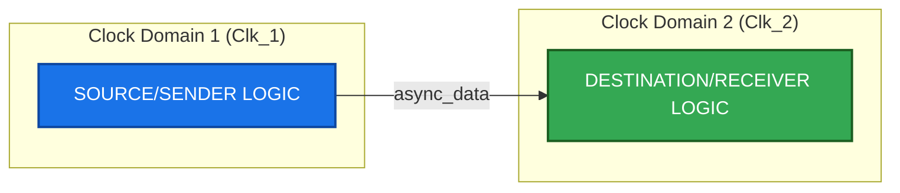
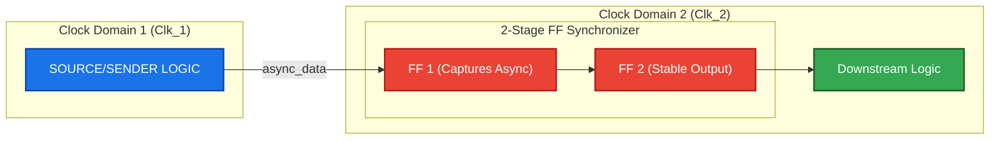
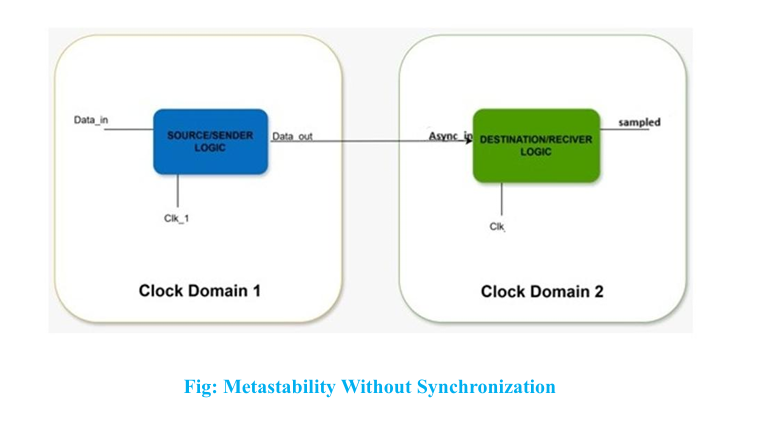

# Demonstrating Metastability without Synchronization
> An educational RTL demonstration of Clock Domain Crossing (CDC) failure modes, timing violations, and the industry-standard 2-stage Flip-Flop (2FF) synchronization solution.

---

## 📌 Project Overview
This repository contains a complete Verilog hardware simulation demonstrating **metastability** in digital design. Metastability is a critical hardware bug that occurs when an asynchronous signal is sampled too close to a clock edge, violating the flip-flop's setup and hold times. 

This project explores:
1. **The Unsafe Design**: Directly sampling an asynchronous input in a different clock domain, risking metastability.
2. **The Safe Design**: Implementing a **2-stage Flip-Flop (2FF) Synchronizer** to absorb metastability and output a stable synchronized signal.

---

## 📊 System Architecture

### 1. Unsafe CDC (Without Synchronization)
When passing data from **Clock Domain 1** to **Clock Domain 2** directly, the signal violates timing requirements of the receiver flip-flop if it transitions during its setup/hold window.



---

### 2. Safe CDC (With 2FF Synchronizer)
By cascading two flip-flops back-to-back in the destination clock domain, we allow the first flip-flop's output to go metastable and settle to a stable level ($0$ or $1$) before it is clocked into the second stage. This significantly reduces the probability of metastability propagation.



---

## 🛠️ Folder Structure
This repository adheres to standard digital IC design structures:
```
metastability/
├── .github/                     # GitHub Workflows & PR Templates
├── .gitignore                   # Ignores simulator dumps (*.vcd, *.vvp, etc.)
├── LICENSE                      # MIT Open Source License
├── CONTRIBUTING.md              # Project Contribution Guidelines
├── README.md                    # This document
├── rtl/                         # Register Transfer Level (RTL) code
├── tb/                          # Verification files / Testbenches
└── sim/                         # Compilation and simulation runner
```

---

## 📂 Codebase Details & Explanations

Refer to the source files directly in the repository structure:

### 1. Unsafe Design: [rtl/metastability_unsafe.v](file:///d:/linkedin_post/metastability/rtl/metastability_unsafe.v)
This module connects an asynchronous input directly to a destination flip-flop.
* **Ports**:
  * `clk`: The clock of the receiving domain.
  * `async_in`: The data input coming from a different, unsynchronized clock domain.
  * `sampled`: The output register that stores the sampled value.
* **Logic**: On the rising edge of `clk`, the flip-flop samples `async_in`. If `async_in` transitions within the setup/hold window of the flip-flop, the output enters a metastable state, leading to unpredictable levels and glitches in the downstream logic.

### 2. Safe Design: [rtl/metastability_safe.v](file:///d:/linkedin_post/metastability/rtl/metastability_safe.v)
This module adds an intermediate flip-flop stage to capture and resolve metastability.
* **Ports**:
  * `clk`: The clock of the receiving domain.
  * `async_in`: The asynchronous input data.
  * `sampled`: The synchronized stable output.
* **Logic**: Uses a 2-stage shift register (`sync_reg_1` and `sync_reg_2`).
  * `sync_reg_1` samples `async_in` on the rising clock edge and may go metastable if a timing violation occurs.
  * Over the course of the clock cycle, the metastable state has a high probability of decaying to a stable logic level (`0` or `1`).
  * `sync_reg_2` samples the resolved, stable value of `sync_reg_1` on the next clock edge, transmitting a clean digital signal downstream.

### 3. Verification Testbenches
* **Unsafe Testbench**: [tb/tb_metastability_unsafe.v](file:///d:/linkedin_post/metastability/tb/tb_metastability_unsafe.v)
  * Generates a 100MHz clock (10ns period).
  * Drives `async_in` with three scenarios:
    1. A safe transition halfway between clock edges.
    2. A transition `0.1ns` before the clock edge (violating setup time).
    3. A transition exactly on the clock edge.
* **Safe Testbench**: [tb/tb_metastability_safe.v](file:///d:/linkedin_post/metastability/tb/tb_metastability_safe.v)
  * Runs the same stimulus against the synchronized design to prove stability.

---

## 🔍 Understanding Metastability & Synchronization

### What is Metastability?
Metastability is an unstable state that a flip-flop enters when its input changes within its **setup time ($t_s$)** or **hold time ($t_h$)** window relative to the clock's active edge. 
Instead of instantly changing to a clean logic `1` or `0`, the output hangs in an intermediate state ($V_{DD}/2$) or oscillates, eventually settling randomly after some delay.

### The Math: Mean Time Between Failures (MTBF)
The probability of a CDC failure is calculated using the MTBF formula:
$$\text{MTBF} = \frac{e^{K_2 \cdot \tau}}{T_0 \cdot f_{clk} \cdot f_{data}}$$

Where:
- $f_{clk}$ is the receiver clock frequency.
- $f_{data}$ is the asynchronous data transition frequency.
- $\tau$ is the settling time budget.
- $K_2, T_0$ are hardware constants specific to the silicon technology.

Adding a second Flip-Flop increases the settling time budget $\tau$ by a full clock cycle:
$$\tau_{safe} = T_{clk} - t_{co} - t_{setup}$$
This exponentially increases the MTBF from hours to millions of years!

---

## 🚀 Running the Simulations

### Prerequisites
To compile code and view waveforms, ensure you have the following open-source tools:
1. **Icarus Verilog (iverilog)** - Compilation & Simulation tool.
   * *Windows*: [Download from Bleyer](http://bleyer.org/icarus/)
   * *Ubuntu/Debian*: `sudo apt-get install iverilog`
   * *macOS*: `brew install icarus-verilog`
2. **GTKWave** - Graphical Waveform Viewer.
   * *Ubuntu/Debian*: `sudo apt-get install gtkwave`
   * *macOS*: `brew install gtkwave`

### Option 1: On Windows
Navigate to the `sim/` folder in terminal and execute:
```cmd
cd sim
run_sim.bat
```

### Option 2: On Linux / macOS / Git Bash
Use the provided `Makefile`:
```bash
cd sim
make         # Compiles and runs both simulations
make clean   # Cleans compiled files
```

To view waveforms:
```bash
make view_unsafe   # Opens unsafe waveforms in GTKWave
make view_safe     # Opens safe waveforms in GTKWave
```

---

## 💻 Expected Simulation Outputs

When running the simulations, the console logs print verification messages indicating successful compilation and wave file generation.

### Unsafe CDC Simulation Console Log
```text
=======================================================================
               Metastability CDC Simulation Runner (Windows)
=======================================================================

[1/4] Compiling Unsafe Design (Unsynchronized CDC)...
[2/4] Running Unsafe Simulation...
----------------------------------------------------------------
Starting simulation for Unsynchronized CDC (Unsafe)...
----------------------------------------------------------------
Simulation complete. VCD dumped to metastability_unsafe.vcd
----------------------------------------------------------------
```

### Safe CDC Simulation Console Log
```text
[3/4] Compiling Safe Design (Synchronized CDC)...
[4/4] Running Safe Simulation...
----------------------------------------------------------------
Starting simulation for Synchronized CDC (Safe)...
----------------------------------------------------------------
Simulation complete. VCD dumped to metastability_safe.vcd
----------------------------------------------------------------

=======================================================================
Simulations completed successfully!
Waveforms dumped:
 - metastability_unsafe.vcd
 - metastability_safe.vcd
=======================================================================
```

---

## 📊 Simulation Analysis & Waveforms



### 📈 ASCII Waveform Timing Analysis
The following timing diagram represents the GTKWave simulation traces. It illustrates the exact difference between direct sampling (unsafe) and 2-stage FF synchronization (safe) when the asynchronous input changes near clock edges.

```text
Time (ps)       0      10     20     30     40     50     60     70     80
                ┌──┐   ┌──┐   ┌──┐   ┌──┐   ┌──┐   ┌──┐   ┌──┐   ┌──┐
clk             │  │   │  │   │  │   │  │   │  │   │  │   │  │   │  │
             ───┘  └───┘  └───┘  └───┘  └───┘  └───┘  └───┘  └───┘  └───
                       ┌──────┐      ┌─────────────────────────┐
async_in               │      │      │                         │
             ──────────┘      └──────┘                         └───────
                       ^             ^             ^
                       │             │             │
                   Safe Case    Setup Viol.   Setup Viol.
                   (at 12ps)    (at 25ps)     (at 34ps)
                       ┌──────┐      ┌─────────────────────────┐
sampled (Unsafe)       │      │      │                         │
             ──────────┘      └──────┘                         └───────
                                     (Outputs transition on violating
                                      edges, risking metastability)
                                     
                                     ┌─────────────────────────┐
sync_reg_1                           │                         │
(Safe Stage 1) ──────────────────────┘                         └───────
                                     (Samples unstable level; resolves
                                      to a stable state by 35ps)
                                            ┌──────────────────┐
sync_reg_2                                  │                  │
(Safe Stage 2) ─────────────────────────────┘                  └───────
                                            (Clean, synchronized stable 
                                             output delayed by 1 cycle)
```


### Unsynchronized CDC Waveform (`metastability_unsafe.vcd`)
In the unsafe design, `async_in` transitions right on the clock edge:
* At `12ps`, `async_in` rises. This is a safe crossing since it's far from the rising edges of `clk` (at `5ps` and `15ps`).
* At `25ps`, `async_in` rises exactly on the rising edge of `clk` (at `25ps`). In physical hardware, this violates setup/hold times causing `sampled` to oscillate or settle arbitrarily, manifesting as logic glitches in subsequent hardware stages.
* At `34ps`, `async_in` falls just `1ps` before the clock edge at `35ps`. This is also a timing violation.

### Synchronized CDC Waveform (`metastability_safe.vcd`)
Using the 2FF synchronizer:
* `sync_reg_1` captures the unstable value on the clock edge and goes metastable.
* By the next clock edge (`35ps`), `sync_reg_1` has resolved to a stable state.
* `sync_reg_2` samples the resolved value, ensuring a clean, glitch-free, synchronized output is sent to downstream logic.

---

## 🏆 Key Takeaways
1. **Never sample asynchronous signals directly** into receiver clock logic.
2. **2FF Synchronizers** are the standard, baseline solution for single-bit CDC signals.
3. For multi-bit control or data paths, use **Gray Code encoding**, **Handshake Protocols**, or **Asynchronous FIFOs** to prevent data skew issues.
