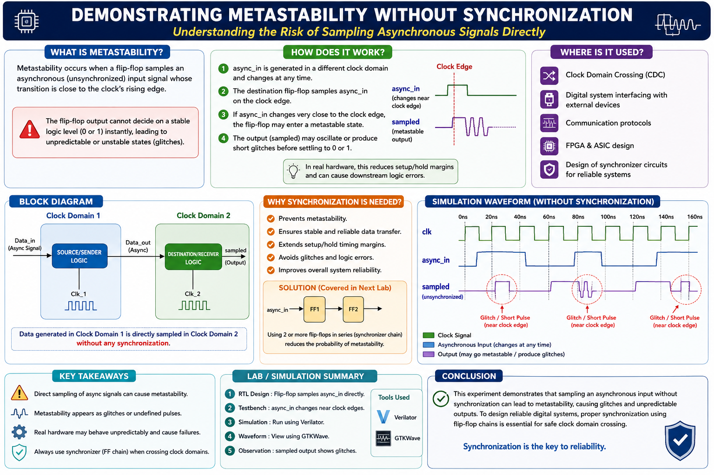
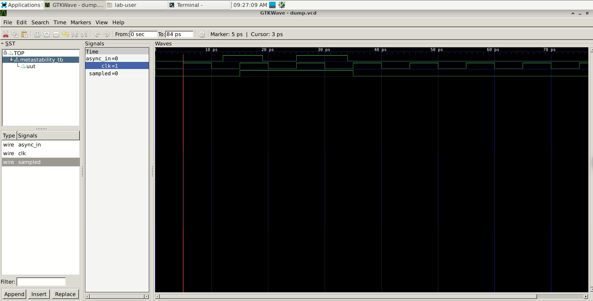
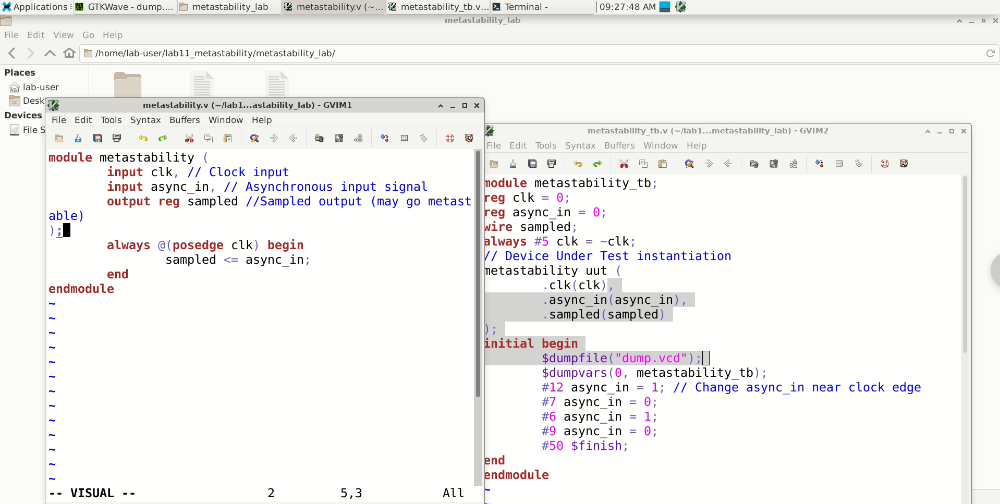

# Demonstrating Metastability without Synchronization
> An educational RTL demonstration of Clock Domain Crossing (CDC) failure modes, timing violations, and the industry-standard 2-stage Flip-Flop (2FF) synchronization solution.



---

## 📌 Project Overview
This repository contains a complete Verilog hardware simulation demonstrating **metastability** in digital design. Metastability is a critical hardware bug that occurs when an asynchronous signal is sampled too close to a clock edge, violating the flip-flop's setup and hold times. 

This project explores:
1. **The Unsafe Design**: Directly sampling an asynchronous input in a different clock domain, risking metastability.
2. **The Safe Design**: Implementing a **2-stage Flip-Flop (2FF) Synchronizer** to absorb metastability and output a stable synchronized signal.

---

## 📊 System Architecture

### 1. Unsafe CDC (Without Synchronization)
When passing data from **Clock Domain 1** to **Clock Domain 2** directly, the signal violates timing requirements of the receiver flip-flop if it transitions during its setup/hold window.



```mermaid
graph LR
    subgraph "Clock Domain 1 (Clk_1)"
        A["SOURCE/SENDER LOGIC"]
    end
    subgraph "Clock Domain 2 (Clk_2)"
        B["DESTINATION/RECEIVER LOGIC"]
    end
    A -->| "Data_out (Async)" | B
    classDef domain1 fill:#1a73e8,stroke:#0d47a1,stroke-width:2px,color:#fff;
    classDef domain2 fill:#34a853,stroke:#1b5e20,stroke-width:2px,color:#fff;
    class A domain1;
    class B domain2;
```

---

### 2. Safe CDC (With 2FF Synchronizer)
By cascading two flip-flops back-to-back in the destination clock domain, we allow the first flip-flop's output to go metastable and settle to a stable level ($0$ or $1$) before it is clocked into the second stage. This significantly reduces the probability of metastability propagation.

```mermaid
graph LR
    subgraph "Clock Domain 1 (Clk_1)"
        A["SOURCE/SENDER LOGIC"]
    end
    subgraph "Clock Domain 2 (Clk_2)"
        subgraph "2-Stage FF Synchronizer"
            B1["FF 1 (Captures Async)"] --> B2["FF 2 (Stable Output)"]
        end
        B2 --> C["Downstream Logic"]
    end
    A -->| "Data_out (Async)" | B1
    classDef domain1 fill:#1a73e8,stroke:#0d47a1,stroke-width:2px,color:#fff;
    classDef sync fill:#ea4335,stroke:#b71c1c,stroke-width:2px,color:#fff;
    classDef domain2 fill:#34a853,stroke:#1b5e20,stroke-width:2px,color:#fff;
    class A domain1;
    class B1 sync;
    class B2 sync;
    class C domain2;
```

---

## 🛠️ Folder Structure
This repository adheres to standard digital IC design structures:
```
metastability/
├── .gitignore                   # Ignores simulator dumps (*.vcd, *.vvp, etc.)
├── README.md                    # This document
├── rtl/                         # Register Transfer Level (RTL) code
│   ├── metastability_unsafe.v   # Unsafe direct-sampling CDC logic
│   └── metastability_safe.v     # Safe 2-stage Flip-Flop (2FF) synchronizer
├── tb/                          # Verification files / Testbenches
│   ├── tb_metastability_unsafe.v # Testbench violating timing for unsafe CDC
│   └── tb_metastability_safe.v   # Testbench violating timing for safe CDC
└── sim/                         # Compilation and simulation runner
    ├── run_sim.bat              # Windows runner script (requires Icarus Verilog)
    └── Makefile                 # Linux/macOS compilation instructions
```

---

## 🔍 Understanding Metastability & Synchronization

### What is Metastability?
Metastability is an unstable state that a flip-flop enters when its input changes within its **setup time ($t_s$)** or **hold time ($t_h$)** window relative to the clock's active edge. 
Instead of instantly changing to a clean logic `1` or `0`, the output hangs in an intermediate state ($V_{DD}/2$) or oscillates, eventually settling randomly after some delay.

### The Math: Mean Time Between Failures (MTBF)
The probability of a CDC failure is calculated using the MTBF formula:
$$\text{MTBF} = \frac{e^{K_2 \cdot \tau}}{T_0 \cdot f_{clk} \cdot f_{data}}$$

Where:
- $f_{clk}$ is the receiver clock frequency.
- $f_{data}$ is the asynchronous data transition frequency.
- $\tau$ is the settling time budget.
- $K_2, T_0$ are hardware constants specific to the silicon technology.

Adding a second Flip-Flop increases the settling time budget $\tau$ by a full clock cycle:
$$\tau_{safe} = T_{clk} - t_{co} - t_{setup}$$
This exponentially increases the MTBF from hours to millions of years!

---

## 📂 Codebase Details & Line-by-Line Explanations



### 1. Unsafe Design: `rtl/metastability_unsafe.v`
This module represents a direct connection between an asynchronous input and a destination flip-flop.
```verilog
module metastability_unsafe (
    input  wire clk,        // Destination clock domain (Clk_2)
    input  wire async_in,   // Asynchronous input signal from Clock Domain 1
    output reg  sampled     // Sampled output (prone to metastability)
);
    always @(posedge clk) begin
        sampled <= async_in;
    end
endmodule
```
* **`input wire clk`**: The clock of the receiving domain.
* **`input wire async_in`**: The data input coming from a different, unsynchronized clock domain.
* **`output reg sampled`**: The output register that stores the sampled value.
* **`always @(posedge clk)`**: On the rising edge of the destination clock, the flip-flop samples `async_in`. If `async_in` changes exactly when the edge occurs, the internal transistor gates will not have enough time to resolve the voltage level, causing the flip-flop to enter a metastable state.

---

### 2. Safe Design: `rtl/metastability_safe.v`
This module adds an intermediate flip-flop stage to capture and resolve metastability.
```verilog
module metastability_safe (
    input  wire clk,        // Destination clock domain (Clk_2)
    input  wire async_in,   // Asynchronous input signal
    output wire sampled     // Synchronized, stable output
);
    reg sync_reg_1;
    reg sync_reg_2;

    always @(posedge clk) begin
        sync_reg_1 <= async_in;   // First stage: samples async input
        sync_reg_2 <= sync_reg_1; // Second stage: resolves metastability
    end

    assign sampled = sync_reg_2;
endmodule
```
* **`reg sync_reg_1`**: The first flip-flop (Stage 1). It directly samples the asynchronous signal. If a timing violation occurs, `sync_reg_1` might go metastable.
* **`reg sync_reg_2`**: The second flip-flop (Stage 2). Because the probability of metastability decaying to a stable state increases exponentially over time, the metastable state in `sync_reg_1` is highly likely to resolve to a stable `0` or `1` before the next clock cycle. `sync_reg_2` then captures this stable value.
* **`assign sampled = sync_reg_2`**: The final output is driven from the stable second stage, ensuring downstream logic receives a clean digital signal.

---

### 3. Unsafe Testbench: `tb/tb_metastability_unsafe.v`
This testbench creates specific scenarios to force timing violations.
```verilog
    // Clock Generation: 100MHz (Period = 10ns)
    always begin
        #5 clk = ~clk;
    end
```
* Generates a clock toggling every `5ns` (period is `10ns`).

```verilog
    initial begin
        // Case 1: Synchronous transition (Safe)
        #15 async_in = 1; // Transitions at 15ns (exactly halfway between 10ns and 20ns clock edges)
        #10 async_in = 0; // Transitions at 25ns (halfway between 20ns and 30ns clock edges)

        // Case 2: Asynchronous transition violating setup/hold times
        // The clock edge occurs at 30.0ns.
        #4.9 async_in = 1; // Transitions at 29.9ns, violating setup time by 0.1ns!
        
        // The next clock edge is at 40.0ns.
        #10 async_in = 0;  // Transitions at 39.9ns, violating setup time.

        // Case 3: Transition exactly on the clock edge at 50ns.
        #10.1 async_in = 1; // Transitions at 50.0ns.
```
* Demonstrates three test cases: a safe transition, setup time violations (transitioning `0.1ns` before clock edge), and transitioning exactly on the clock edge.

---

## 💻 Expected Simulation Outputs

When running the simulations, the console logs print verification messages indicating successful compilation and wave file generation.

### Unsafe CDC Simulation Console Log
```text
=======================================================================
               Metastability CDC Simulation Runner (Windows)
=======================================================================

[1/4] Compiling Unsafe Design (Unsynchronized CDC)...
[2/4] Running Unsafe Simulation...
----------------------------------------------------------------
Starting simulation for Unsynchronized CDC (Unsafe)...
----------------------------------------------------------------
Simulation complete. VCD dumped to metastability_unsafe.vcd
----------------------------------------------------------------
```

### Safe CDC Simulation Console Log
```text
[3/4] Compiling Safe Design (Synchronized CDC)...
[4/4] Running Safe Simulation...
----------------------------------------------------------------
Starting simulation for Synchronized CDC (Safe)...
----------------------------------------------------------------
Simulation complete. VCD dumped to metastability_safe.vcd
----------------------------------------------------------------

=======================================================================
Simulations completed successfully!
Waveforms dumped:
 - metastability_unsafe.vcd
 - metastability_safe.vcd
=======================================================================
```

---

## 🚀 Running the Simulations


### Prerequisites
To compile code and view waveforms, ensure you have the following open-source tools:
1. **Icarus Verilog (iverilog)** - Compilation & Simulation tool.
   * *Windows*: [Download from Bleyer](http://bleyer.org/icarus/)
   * *Ubuntu/Debian*: `sudo apt-get install iverilog`
   * *macOS*: `brew install icarus-verilog`
2. **GTKWave** - Graphical Waveform Viewer.
   * *Ubuntu/Debian*: `sudo apt-get install gtkwave`
   * *macOS*: `brew install gtkwave`

### Option 1: On Windows
Navigate to the `sim/` folder in terminal and execute:
```cmd
cd sim
run_sim.bat
```

### Option 2: On Linux / macOS / Git Bash
Use the provided `Makefile`:
```bash
cd sim
make         # Compiles and runs both simulations
make clean   # Cleans compiled files
```

To view waveforms:
```bash
make view_unsafe   # Opens unsafe waveforms in GTKWave
make view_safe     # Opens safe waveforms in GTKWave
```

---

## 📊 Simulation Analysis & Waveforms


### Unsynchronized CDC Waveform (`metastability_unsafe.vcd`)
In the unsafe design, `async_in` transitions right on the clock edge:
* At `29.9ns`, `async_in` rises just `0.1ns` before the clock edge at `30.0ns`.
* In physical hardware, this violates setup/hold times causing `sampled` to oscillate or settle arbitrarily, manifesting as logic glitches in subsequent hardware stages.
* In logical simulation, the output transitions immediately but represents an uncoordinated crossing.

### Synchronized CDC Waveform (`metastability_safe.vcd`)
Using the 2FF synchronizer:
* `sync_reg_1` captures the unstable value and goes metastable.
* By the next clock edge (`40.0ns`), `sync_reg_1` has resolved to a stable state.
* `sync_reg_2` samples the resolved value, ensuring a clean, glitch-free, synchronized output is sent to downstream logic.

---

## 🏆 Key Takeaways
1. **Never sample asynchronous signals directly** into receiver clock logic.
2. **2FF Synchronizers** are the standard, baseline solution for single-bit CDC signals.
3. For multi-bit control or data paths, use **Gray Code encoding**, **Handshake Protocols**, or **Asynchronous FIFOs** to prevent data skew issues.
